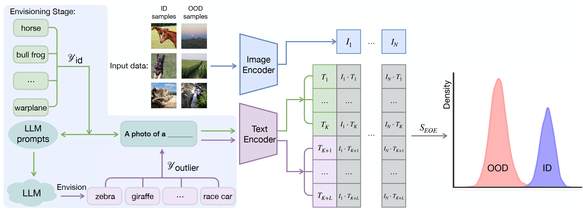

<h1 align="center">EOE: Envisioning Outlier Exposure</h1>
<p align="center">
    <a href="https://arxiv.org/pdf/2406.00806"></a>
    <a href="https://openreview.net/pdf?id=xZO7SmM12y">  </a>
</p>

Official code for the paper "Envisioning Outlier Exposure by Large Language Models for Out-of-Distribution Detection" (ICML 2024).

### Illustration


### Abstract
Detecting out-of-distribution (OOD) samples is essential when deploying machine learning models in open-world scenarios. Zero-shot OOD detection, requiring no training on in-distribution (ID) data, has been possible with the advent of vision-language models like CLIP. Existing methods build a text-based classifier with only closed-set labels. However, this largely restricts the inherent capability of CLIP to recognize samples from large and open label space. In this paper, we propose to tackle this constraint by leveraging the expert knowledge and reasoning capability of large language models (LLM) to Envision potential Outlier Exposure, termed EOE, without access to any actual OOD data. Owing to better adaptation to open-world scenarios, EOE can be generalized to different tasks, including far, near, and fine-grained OOD detection. Technically, we design (1) LLM prompts based on visual similarity to generate potential outlier class labels specialized for OOD detection, as well as (2) a new score function based on potential outlier penalty to distinguish hard OOD samples effectively. Empirically, EOE achieves state-of-the-art performance across different OOD tasks and can be effectively scaled to the ImageNet-1K dataset.

## Setup
### Dependencies
```bash
pip install -r requirements.txt
# what's more, please add your openai/poe key in .env
touch .env
echo "OPENAI_API_KEY=your_openai_api_key_here" >> .env
echo "POE_API_KEY=your_poe_api_key_here" >> .env
```

### Dataset Preparation
#### In-distribution Datasets
We consider the following ID datasets: [`CUB-200`](http://www.vision.caltech.edu/datasets/cub_200_2011/), [`Standford-Cars`](http://ai.stanford.edu/~jkrause/cars/car_dataset.html), [`Food-101`](https://data.vision.ee.ethz.ch/cvl/datasets_extra/food-101/), [`Oxford-Pet`](https://www.robots.ox.ac.uk/~vgg/data/pets/), `ImageNet-1k`, `ImageNet-10`, `ImageNet-20`, `CUB-100`, `Stanford-Cars-98`, `Food-50`, `Oxford-Pet-18`, `CIFAR-10`, `CIFAR-100`, `ImageNet-C`, and `ImageNet-Sketch`

Specifically,
1. Please refer to [MCM](https://github.com/deeplearning-wisc/MCM/#In-distribution-Datasets) for the preparation of the following datasets:
- [`CUB-200`](http://www.vision.caltech.edu/datasets/cub_200_2011/), [`Standford-Cars`](http://ai.stanford.edu/~jkrause/cars/car_dataset.html), [`Food-101`](https://data.vision.ee.ethz.ch/cvl/datasets_extra/food-101/), [`Oxford-Pet`](https://www.robots.ox.ac.uk/~vgg/data/pets/)
- `ImageNet-1k`, `ImageNet-10`, `ImageNet-20`
2. `CUB-100`, `Stanford-Cars-98`, `Food-50`, `Oxford-Pet-18` are randomly extracted from - [`CUB-200`](http://www.vision.caltech.edu/datasets/cub_200_2011/), [`Standford-Cars`](http://ai.stanford.edu/~jkrause/cars/car_dataset.html), [`Food-101`](https://data.vision.ee.ethz.ch/cvl/datasets_extra/food-101/), [`Oxford-Pet`](https://www.robots.ox.ac.uk/~vgg/data/pets/). We provide the index of the randomly extracted categories used in the paper in [CUB-100](data/CUB-100/selected_100_classes.pkl), [Stanford-Cars-98](data/Stanford-Cars-98/selected_98_classes.pkl), [Food-50](data/Food-50/selected_50_classes.pkl), and [Oxford-Pet-18](data/Oxford-Pet-18/selected_18_classes.pkl)
3. The ImageNet-C and ImageNet-Sketch datasets can be downloaded from [ImageNet-C](https://zenodo.org/records/2235448) and [ImageNet-Sketch](https://github.com/HaohanWang/ImageNet-Sketch), respectively. CIFAR-10/100 will be automatically downloaded when you run the code,

Please put the above datasets into `./datasets`.

#### Out-of-Distribution Datasets

We consider the following OOD datasets: [iNaturalist](https://arxiv.org/abs/1707.06642), [SUN](https://vision.princeton.edu/projects/2010/SUN/), [Places](https://arxiv.org/abs/1610.02055), [Texture](https://arxiv.org/abs/1311.3618), ImageNet10, ImageNet20, CUB-100(OOD), Stanford-Cars-98(OOD), Food-51(OOD), and Oxford-Pet-19(OOD), [SSB-hard](https://arxiv.org/pdf/2110.06207), [NINCO](https://arxiv.org/pdf/2306.00826)

Specifically,
1. Please refer to [Huang et al. 2021](https://github.com/deeplearning-wisc/large_scale_ood#out-of-distribution-dataset) for the preparation of the following datasets: [iNaturalist](https://arxiv.org/abs/1707.06642), [SUN](https://vision.princeton.edu/projects/2010/SUN/), [Places](https://arxiv.org/abs/1610.02055), [Texture](https://arxiv.org/abs/1311.3618)
2. CUB-100(OOD), Stanford-Cars-98(OOD), Food-51(OOD), and Oxford-Pet-19(OOD) are the remaining categories in the datasets([`CUB-200`](http://www.vision.caltech.edu/datasets/cub_200_2011/), [`Standford-Cars`](http://ai.stanford.edu/~jkrause/cars/car_dataset.html), [`Food-101`](https://data.vision.ee.ethz.ch/cvl/datasets_extra/food-101/), [`Oxford-Pet`](https://www.robots.ox.ac.uk/~vgg/data/pets/)) and are automatically obtained after loading the ID datasets([CUB-100](data/CUB-100/selected_100_classes.pkl), [Stanford-Cars-98](data/Stanford-Cars-98/selected_98_classes.pkl), [Food-50](data/Food-50/selected_50_classes.pkl), and [Oxford-Pet-18](data/Oxford-Pet-18/selected_18_classes.pkl)).
3. Please refer to [OpenOOD](https://github.com/Jingkang50/OpenOOD#data) for the preparation of the following datasets: [SSB-hard](https://arxiv.org/pdf/2110.06207), [NINCO](https://arxiv.org/pdf/2306.00826)

Please put the following datasets ([iNaturalist](https://arxiv.org/abs/1707.06642), [SUN](https://vision.princeton.edu/projects/2010/SUN/), [Places](https://arxiv.org/abs/1610.02055), [Texture](https://arxiv.org/abs/1311.3618), [SSB-hard](https://arxiv.org/pdf/2110.06207), [NINCO](https://arxiv.org/pdf/2306.00826)) into `./datasets/ImageNet_OOD_dataset`.


## Quick Start
The main script for evaluating OOD detection performance is `eval_ood_detection.py`. Here are the list of main arguments:

- `--score`: The OOD detection score, which accepts any of the following:
  - `EOE`: Envisioning Outlier Exposure score
  - `MCM`: Maximum Concept Matching score
  - `energy`: The Energy score
  - `max-logit`: Max Logit score
- `--generate_class`: whether to envision OOD candidate classes or loaded from existing JSONs
- `--L`: the length of envisioned OOD class labels, for far/fine-grained: L=500, for near: L=3
- `--ood_task`: far, near, fine-grained OOD tasks
- `llm_model`: LLMs
- `--score_ablation`: Ablation studies in EOE in terms of Score Functions (using envisioned OOD class labels):
  - `EOE`
  - `MAX`
  - `MSP`
  - `energy`
  - `max-logit`


You can directly use the following script
```sh
bash eval.sh
```


### Citation

If you find our work useful, please consider citing our paper:

```
@inproceedings{cao2024envisioning,
  title={Envisioning Outlier Exposure by Large Language Models for Out-of-Distribution Detection},
  author={Cao, Chentao and Zhong, Zhun and Zhou, Zhanke and Liu, Yang and Liu, Tongliang and Han, Bo},
  booktitle={ICML},
  year={2024}
}
```

Our implementation is based on [MCM](https://openreview.net/pdf?id=KnCS9390Va) by Dr. Ming. Thanks for their great work!


### Questions
If you have any questions, please feel free to contact chentaocao1224@gmail.com